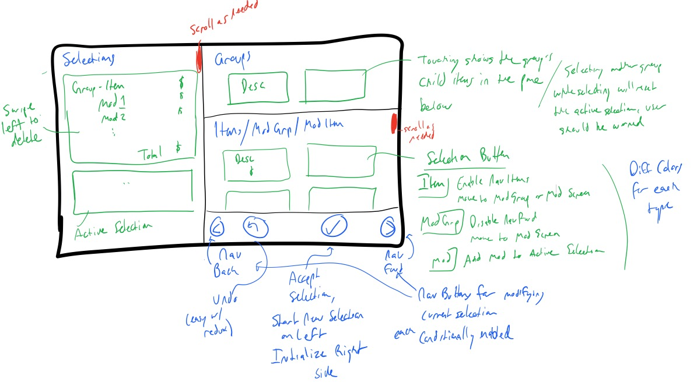

# Games Menu

A toy mobile app aimed at implementing something non trivial in react-native and redux.

## Installation and Running 

Before running the application, you must setup all the dependencies needed to develop react native applications. Dev and Deployment platform details are [here](https://facebook.github.io/react-native/docs/getting-started.html) under **Building Projects with Native Code**.

Once all dependencies (node, watchman, react-native-cli, and iOS/android dev tools) are installed:

- Clone the repository and `cd` to it
- `npm install`
- `react-native run-ios` to run in iOS
- `react-native run-android` to run in Android (either a running simulator or a connected device)

## App Usage

- Select a group from the upper-right
- Select an item below to create the active selection on the left side of the screen (between the gray lines)
- If modifiers are available for the chosen item, they can be selected in the same area. Multiple modifiers can be added to a selection.
- If you make a mistake while making a selection, use the undo button in the lower left of the bottom right pane. Only the previous 10 actions can be undone.
- When you're satisfied with the active selection, press the check mark to accept it. This will move the active selection to the area below the gray lines, and reset the right side of the screen for another selection to be made.
- Confirmed selection items can be deleted by long-pressing the item to be deleted. You will be asked to confirm your choice.
- New groups can be selected at any time, but if there is an active selection shown on the left it will be erased. in this case, you will be asked to confirm your choice.

## Implementation Details & Process

I started the project by drawing a UI wireframe. Some of the things here didn't end up in the final app (not necessary or redundant), but it served as a helpful requirement against which the final UI was implemented.

I took some notes throughout the development process in the [tech docs](tech_docs.md) document, noting the problem statement, my communications to clarify the requirements, and some learning process I went through in implementing this application.

In general, my process and goals were:

- Import the problem data into the application quickly by hard-coding it.
- On startup, transform the input data into a more useful format for rendering the UI. This implementation wound up as a utility function in `./app/lib/appState.js`
- Use [redux](http://redux.js.org/) to manage the application UI state in a sane manner. This was a large undertaking, especially for my first React Native application, but I feel making this choice up-front saved me a lot of back and forth about trying to figure out how to share state across components.
    - To add momentum to my redux usage, I based the initial architecture heavily on [peckish](https://github.com/jlebensold/peckish). However, once I had a design for my application state object, it became clear that its methodology around splitting up reducer functions didn't cleanly apply to my situation, so I ended up reducing a lot of that initial architecture into its final, more simple form.
- Design and implement all of the backend structure **before** implementing the UI. A lot of people like to render a non-functional UI before doing any of the 'hard' stuff, but I prefer working in the other direction. Once all of the backend work is done, the UI really just seems to fall into place. 
    - In this particular scenario, the backend work consisted of the following:
        - Data Import
        - Data Transformation
        - Redux State Design/Implementation
        - Redux Action Design/Implementation
        - Redux Reducer Design/Implementation
    - The commit history will show that I wasn't super dogmatic about this, as I started implementing the nav bar before I finished implementing the reducers. However, most of the UI didn't come into place until the last few commits.
- Test in as many environments as possible. Due to the limited hardware at my disposal, I was only able to test for three separate cases: the iOS Simulator, an Android Virtual Device (the default Nexus 5X virtual device, and my personal smartphone, a Nexus 6P. This limitation was also the primary influence in optimizing the UI for smaller devices.
    

